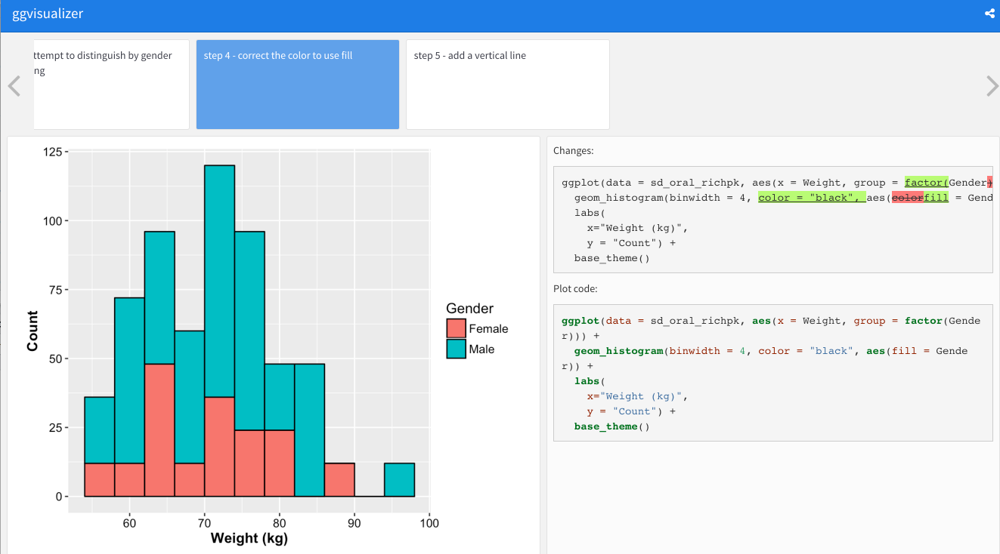

diffr
=======

The purpose of this package is to provide a way of visualizing code changes 
between steps. The idea came from the difficulty in tracking what components of a
complex ggplot correspond to various settings. The functions in this package
provide the underlying infrastructure to diff between 'steps' to visualize
what things are changed similar to `git diff`.

The way the package works is to add an extra macro to Rmd document to declare
what code chunks correspond to steps you want to visualize.

@start step1
```{r }

```
@end step1

Example of interatively building a histogram

